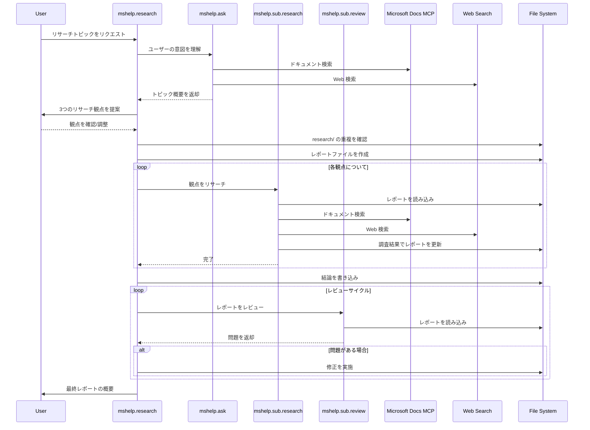

# GitHub Copilot Deep Research for Microsoft

公式ドキュメントと信頼できるソースを使用して、Microsoft 技術に関する徹底的な調査を行うための GitHub Copilot カスタムエージェントとプロンプトのコレクションです。

## 概要

このリポジトリは、Microsoft エコシステムに特化したディープリサーチ機能を提供する GitHub Copilot カスタムエージェントのマルチエージェントシステムを提供します。エージェントは Microsoft Learn ドキュメント、Azure ドキュメント、Web ソースの検索に最適化されており、調査結果を構造化されたリサーチレポートにまとめ、適切な引用によって信頼性を確保します。

**特徴**

- **マルチエージェントリサーチワークフロー**: リサーチプロセスのさまざまな側面を処理するオーケストレーションされたエージェント
- **Microsoft Learn MCP 統合**: 公式 [Microsoft Learn MCP Server](https://learn.microsoft.com/ja-jp/training/support/mcp) からの直接検索と取得
- **Web 検索サポート**: より広いコンテキストのための Web 検索による拡張リサーチ機能
- **自動レビュー**: レポート内のギャップや弱いエビデンスを特定する組み込みレビューエージェント

> 💡 これらのエージェントを使用して生成されたリサーチレポートの例として [2026-01-29-aca-vs-aks-comparison.md](research/2026-01-29-aca-vs-aks-comparison.md) をご覧ください。

## ワークフロー



## ユースケース

- サービス比較とアーキテクチャ決定のリサーチ
- Microsoft 365 の機能と統合オプションの調査
- .NET、Visual Studio、開発者ツールのドキュメント探索
- Microsoft 認定資格のリファレンス資料作成
- 検証済み Microsoft ソースによる技術ドキュメントの作成

## 要件

- Copilot 拡張機能を含む VS Code
- GitHub Copilot サブスクリプション
- [Web Search for Copilot](https://marketplace.visualstudio.com/items?itemName=ms-vscode.vscode-websearchforcopilot) 拡張機能（オプション、Web 検索機能用）

## はじめ方

### オプション 1: ローカルセットアップ

1. このリポジトリ（またはあなたのアカウントにフォークしたリポジトリ）をクローンし、VS Code で開きます：

   ```bash
   git clone https://github.com/openjny/github-copilot-chat-deep-research.git
   cd github-copilot-chat-deep-research
   code .
   ```

2. GitHub Copilot 拡張機能をインストールし、サインインします。
3. （オプション）Web 検索機能のために Web Search for Copilot 拡張機能をインストールします。[Tavily API キー](https://www.tavily.com/) などの追加設定が必要な場合があります。

### オプション 2: GitHub Codespaces

1. このリポジトリをあなたの GitHub アカウントにフォークします。
2. 「Code」ボタンをクリックし、「Open with Codespaces」>「Create codespace on main」を選択します。
3. Codespace 環境でローカルセットアップと同じ手順で必要な拡張機能をインストールします。

GitHub Codespaces の詳細については [公式ドキュメント](https://docs.github.com/ja/codespaces/about-codespaces/what-are-codespaces) をご覧ください。

## 使い方

### クイック質問

`/mshelp.ask` を使用して Microsoft Learn ドキュメントと Web ソースをすばやく検索します：

```
/mshelp.ask Azure Functions の料金プラン
```

### ディープリサーチ

`/mshelp.research` を使用して MS Learn と Web ソースによる包括的なリサーチを行います：

```
/mshelp.research Azure Container Apps と Azure Kubernetes Service の比較
```

または `/mshelp.websearch` を使用して Web に焦点を当てたリサーチを行います：

```
/mshelp.websearch Azure のサーバーレスコンピューティングの最新トレンド
```

### フォローアップ

回答を受け取った後、批判的思考プロンプトを使用して分析します：

```
/criticalthink
```

既存のリサーチレポートのファクトチェックとエビデンス脚注の追加：

```
/factcheck
```

## リサーチレポートの規約

- ファイル名は `YYYY-MM-DD-<slug>.md` の形式に従う
- レポートには事実のみを記載し、推測や意見は含めない
- すべての主張には URL 付きの脚注引用を含める（docs.microsoft.com または learn.microsoft.com が望ましい）
- リサーチ結果はデータ消費のために構造化される

## ライセンス

MIT
