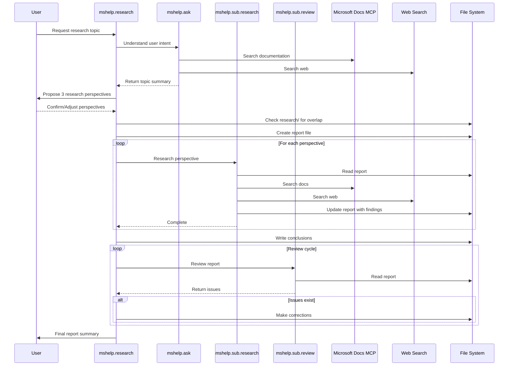

# GitHub Copilot Deep Research for Microsoft

A collection of GitHub Copilot custom agents and prompts designed for conducting thorough research on Microsoft technologies using official documentation and trusted sources.

> 💡 [日本語版 README はこちら](README.ja.md)

## Overview

This repository provides a multi-agent system of GitHub Copilot custom agents that enables deep research capabilities focused on Microsoft ecosystem. The agents are optimized to search Microsoft Learn documentation, Azure docs, and web sources, compile findings into structured research reports, and ensure credibility through proper citation.

**Features**

- **Multi-Agent Research Workflow**: Orchestrated agents that handle different aspects of the research process
- **Microsoft Learn MCP Integration**: Direct search and retrieval from official [Microsoft Learn MCP Server](https://learn.microsoft.com/en-us/training/support/mcp)
- **Web Search Support**: Extended research capabilities through web search for broader context
- **Automated Review**: Built-in review agent to identify gaps and weak evidence in reports

> 💡 See [2026-01-29-aca-vs-aks-comparison.md](research/2026-01-29-aca-vs-aks-comparison.md) for an example research report generated using these agents.

## Workflow



## Use Cases

- Researching service comparisons and architecture decisions
- Investigating Microsoft 365 features and integration options
- Exploring .NET, Visual Studio, and developer tools documentation
- Compiling reference materials for Microsoft certifications
- Creating technical documentation with verified Microsoft sources

## Requirements

- VS Code with Copilot extension
- GitHub Copilot Subscription
- [Web Search for Copilot](https://marketplace.visualstudio.com/items?itemName=ms-vscode.vscode-websearchforcopilot) extension (optional, for web search capabilities)

## How to get started

### Option 1: Local Setup

1. Create your own repository from this template:
   - Click the **Use this template** button at the top of the repository page
   - Select **Create a new repository**
   - Choose your account/organization and repository name
2. Clone your new repository and open it in VS Code:

   ```bash
   git clone https://github.com/<your-account>/<your-repo>.git
   cd <your-repo>
   code .
   ```

3. Install the GitHub Copilot extension and sign in.
4. (Optional) Install the Web Search for Copilot extension for web search capabilities. This may require additional configuration such as [Tavily API key](https://www.tavily.com/).

### Option 2: GitHub Codespaces

1. Create your own repository from this template (click **Use this template** > **Create a new repository**).
2. In your new repository, click the **Code** button and select **Open with Codespaces** > **Create codespace on main**.
3. Follow the same steps as the local setup to install the required extensions in the Codespace environment.

See [official documentation](https://docs.github.com/en/repositories/creating-and-managing-repositories/creating-a-repository-from-a-template) for more details on creating repositories from templates.

### Option 3: GitHub Copilot Coding Agent

You can also use this repository with [GitHub Copilot Coding Agent](https://docs.github.com/en/copilot/concepts/agents/coding-agent/about-coding-agent) for autonomous research workflows.


See [Setup for Coding Agent](docs/setup-for-coding-agent.md) for detailed instructions.

## Usage

### Quick Ask

Use `/mshelp.ask` to quickly search Microsoft Learn documentation and web sources:

```
/mshelp.ask Azure Functions pricing tiers
```

### Deep Research

Use `/mshelp.research` for comprehensive research with MS Learn and web sources:

```
/mshelp.research Azure Container Apps vs Azure Kubernetes Service comparison
```

Or use `/mshelp.websearch` for web-focused research:

```
/mshelp.websearch Latest trends in serverless computing on Azure
```

### Follow-up

After receiving a response, use the critical thinking prompt to analyze it:

```
/criticalthink
```

Factcheck and add evidence footnotes to existing research reports:

```
/factcheck
```

## Research Report Conventions

- File names follow the format `YYYY-MM-DD-<slug>.md`
- Reports contain facts only, no inferences or opinions
- All claims must include footnote citations with URLs (preferably to docs.microsoft.com or learn.microsoft.com)
- Research results are structured for data consumption

## License

MIT
