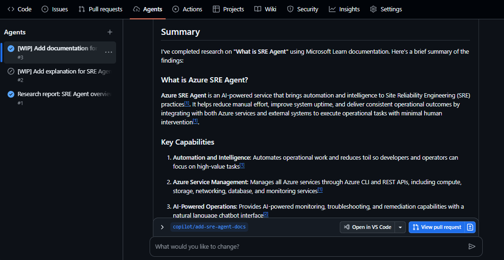
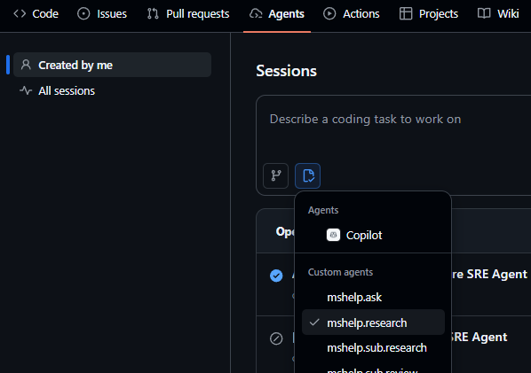

# Setup for Coding Agent

This guide explains how to set up [GitHub Copilot Coding Agent](https://docs.github.com/en/copilot/concepts/agents/coding-agent/about-coding-agent) for deep research workflows.



## Prerequisites

- GitHub Copilot Enterprise or Pro subscription with Coding Agent enabled

## Setup Steps

### 1. Create Repository from Template

Create your own repository from this template:

1. Navigate to <https://github.com/openjny/github-copilot-chat-deep-research>
2. Click the **Use this template** button and select **Create a new repository**
3. Choose your account or organization and enter a repository name
4. Click **Create repository**

### 2. Configure MCP Server

The Coding Agent requires the Microsoft Learn MCP Server to access official documentation.

1. Go to your new repository on GitHub
2. Navigate to **Settings** > **Copilot** > **Coding agent**
3. In the **MCP configuration** section, add the following configuration:

```json
{
  "mcpServers": {
    "microsoft-docs-mcp": {
      "type": "http",
      "url": "https://learn.microsoft.com/api/mcp",
      "tools": ["*"]
    }
  }
}
```

4. Save the configuration

> 💡 For more details on MCP configuration for Coding Agent, see the [official documentation](https://gh.io/copilot-coding-agent-mcp-docs).

### 3. Enable Coding Agent Mode (optional)

You may need to enable Coding Agent mode in your account settings to use the Coding Agent in certain repositories.

Navigate [Copilot account settings](https://github.com/settings/copilot/coding_agent) to confirm your repository is subject to Coding Agent mode.

## Use with Coding Agent

Once configured, you can assign research tasks to one of the custom agents defined in this repository using the Coding Agent interface in GitHub Copilot.


